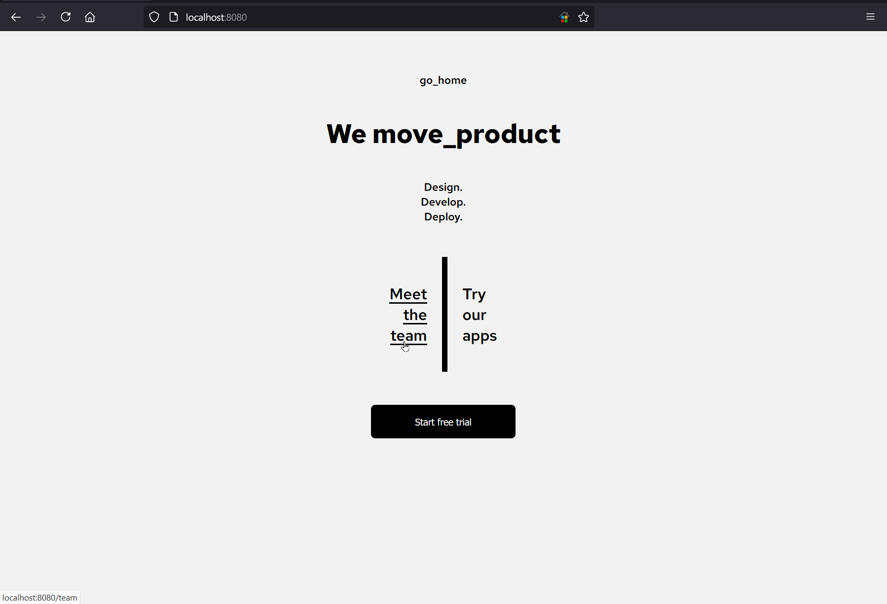
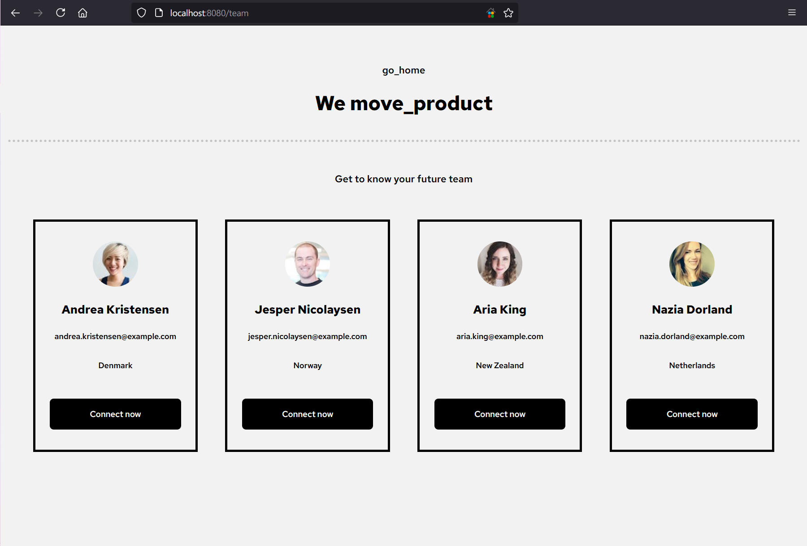

*ABOVE: Sample product homepage using `vue-router`*


*ABOVE: Sample `View` with `fetch` for API pulling and props in child components*

# move_product

`move_product` is a sample `vue 3` project using Composition API, `fetch` and `vue-router` to illustrate a full-featured, typical Vue project set up. It highlights the components system and common operations on components:
* Passing data from an API into a child component using `props`
* Iterating on data in an array which is passed into a component (code reusability)
* Nesting components, i.e. SomeView -> SomeList / SomeSection -> DiscreteListItem (i.e. a Card or TestimonialEntry)

## Project setup
```
npm install
```

### Compiles and hot-reloads for development
```
npm run serve
```

### Compiles and minifies for production
```
npm run build
```

### Lints and fixes files
```
npm run lint
```

### Customize configuration
See [Configuration Reference](https://cli.vuejs.org/config/).
